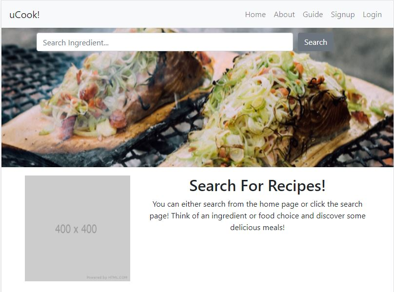
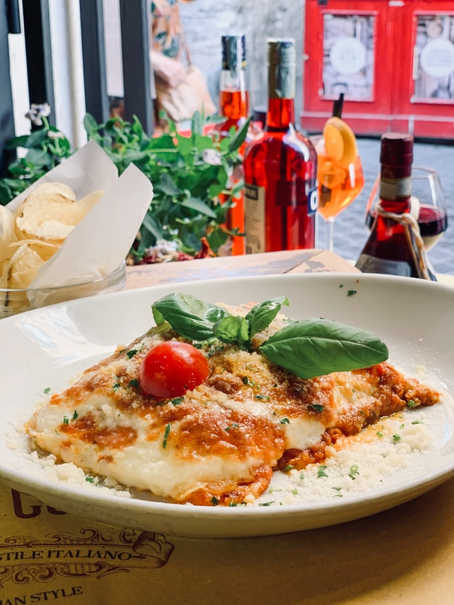
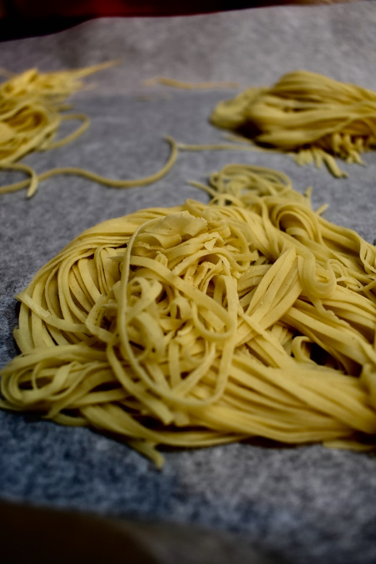
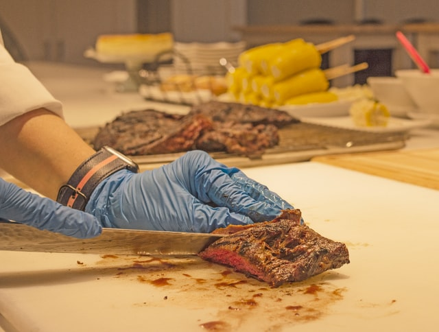

<h1 style="text-align: center">uCook!</h1>

## Table Of Contents
1. [Description](#description)
1. [Specifications](#specifications)
1. [Safety](#safety)
1. [Introduction](#introduction)
1. [Relations](#relations)
1. [Misc Content](#misc)
1. [Create Account](#create-account)
1. [Search Recipe](#search-recipe)
1. [Save Recipe](#save-recipe)
1. [Create Recipe](#create-recipe)

### Description
uCook! is a web application to find, create and save recipes. This application is a full-stack creation using express(backend) and react(front-end)

### Specifications
All That is required for this website is an internet connection. You can access the application from any web browser. It's optional to create an account.

### Safety
Make sure to follow FDA guidelines when cooking your food. Ensure food is cooked thoroughly to avois foodborne ilnesses. Some ingredients may contain penuts or other food that you can be allergic to. READ the ingredients before choosing and buying the food.

### Introduction
There are a couple of features for this website. You can search for ingredients on the go. You can save ingredients(account required) and look at them later. You can create your own ingredients(account required) to look at later.

### Relations
A copy of this document can be found below this paragraph. The code can be found in the list of links below as well. Recipes are pulled from Edmam API na documentation can be found below as well.

User Manual - [https://github.com/ikemous/recipe-capstone/blob/main/README.md](https://github.com/ikemous/recipe-capstone/blob/main/README.md)
Code - [https://github.com/ikemous/recipe-capstone](https://github.com/ikemous/recipe-capstone)
Edmam API - [https://developer.edamam.com/edamam-docs-recipe-api](https://developer.edamam.com/edamam-docs-recipe-api)

### Misc
All images will be either user upload or be a link from an API . There will only be four images from [unsplash.com](unsplash.com). below are some of the possible choices. Images may change over time.

Fonts will be taken from font awesome. see links below for some of the link examples. I will need a save icon to show to save the recipe or recipe ingredient. The untensils icon will be used to show food! The trash icon is to be able to delete anything saved. There could be more icons to add as application creation goes on.

[https://fontawesome.com/icons/utensils?style=solid](https://fontawesome.com/icons/utensils?style=solid)

[https://fontawesome.com/icons/save?style=solid](https://fontawesome.com/icons/save?style=solid)

[https://fontawesome.com/icons/trash-alt?style=solid](https://fontawesome.com/icons/trash-alt?style=solid)

### Create Account

1. Click create account on the top right
1. Fill out email address field
1. Fill out password field
1. Fill out password confirmation field
1. Click signup!

### Forgot Password

1. Click on login button
1. Click on forgot password link
1. Fill out email field
1. Click send email
1. Go to your email
1. Find reset email
1. Click on Reset Link
1. Fill out reset form
1. Click reset password

### Search Recipe
1. Go to the home(landing) page
1. Click the search bar
1. Type desired ingredient or recipe
1. Click Search!

### Save Recipe
1. Login to account
    - See [Create Account](#create-account)
1. Search Recipe
1. Click on delicious recipe
1. Find the heart button(Account Required)
1. Click Heart

### Create Recipe
1. Login to account
    - See [Create Account](#create-account)
1. Click account on navbar
1. Click My Recipes Option
1. Click Create New Recipe Option
1. Fill in Recipe Name
1. Fill in Recipe Description
1. Attach Recipe Image
1. Click Add new Ingredient
1. Fill pop up with ingredient details
1. Click save ingredient
1. Repeat steps 8-10 until all ingredients have been added
1. Click Save Recipe
